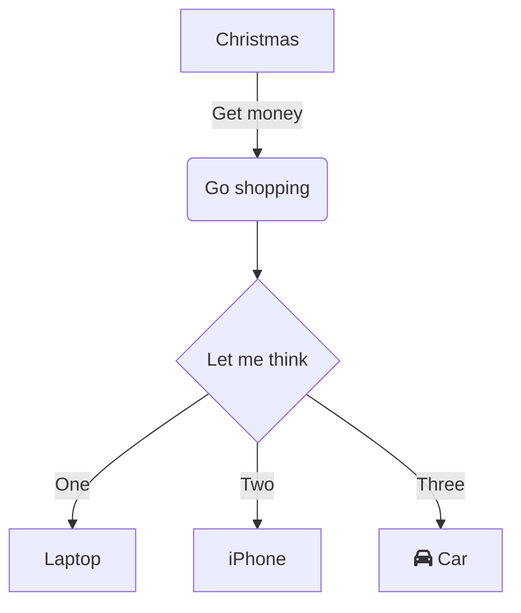

# LaTex Math && Mermaid Diagrams

***LaTeX*** and ***Diagrams***

## Math

***GitHub*** supports [***LaTeX***](https://docs.github.com/en/get-started/writing-on-github/working-with-advanced-formatting/writing-mathematical-expressions) formulas:

1. Inline `$...$`:
  
Inline math formula: $x^n + y^n = z^n$.

2. Display 

  - Variant `$$...$$`:
    
$$x^n + y^n = z^n$$

  - Variant ` ```math ... ``` `
    
```math
x^n + y^n = z^n
```

  - Variant (quoted) `> $$...$$`:

> $$x^n + y^n = z^n$$

## Diagrams

***GitHub*** supports [***Mermaid***](https://docs.github.com/en/get-started/writing-on-github/working-with-advanced-formatting/creating-diagrams) diagrams:


